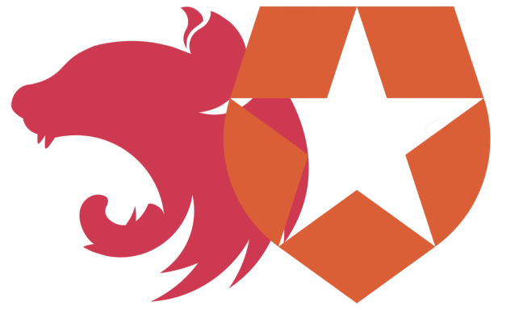

[](http://opensource.org/licenses/MIT)
[](https://npmjs.org/package/nestjs-pact "View this project on npm")
[](https://codecov.io/gh/omer-morad-ni/nestjs-pact)
[](https://github.com/semantic-release/semantic-release)


<p align="center">
  

  <h3 align="center">
    Auth0 NestJS OpenID Connect
  </h3>

  <p align="center">
    <strong>Just a Nice Wrapper for 'express-openid-connect' from Auth0</strong>
  </p>
</p>

## Table Of Contents
- [Installation](#installation)
- [Fully Working Example](#fully-working-example)
- [What is this package?](#what-is-this-package?)
- [License](#license)
- [Acknowledgements](#acknowledgements)


## Installation

```bash
npm i nestjs-auth0-oidc express-openid-connect
```

## Fully Working Example
[See the fully working end-to-end examples of NestJS and Auth0 Open ID Connect](https://github.com/pact-foundation/pact-js/tree/master/examples)

## What is this package?

This package enables you to use `express-openid-connect` (hands: 'oidc') in your NestJS application. \
It supports the auth0 oidc middleware and suggest a built in use of required scopes.

## License

Distributed under the MIT License. See `LICENSE` for more information.

## Acknowledgements

- [Auth0 (express-openid-connect)](https://github.com/pact-foundation/pact-js)
- [NestJS](https://github.com/nestjs/nest)
